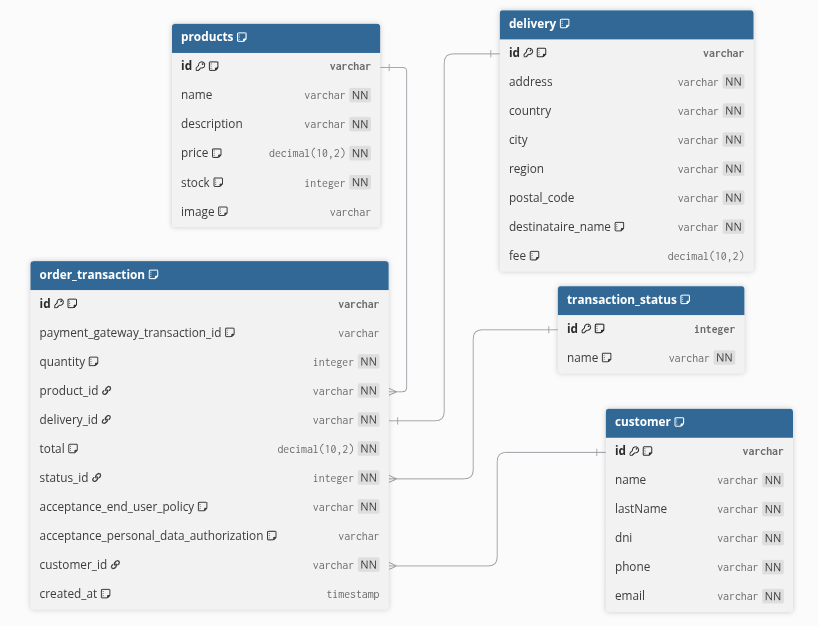
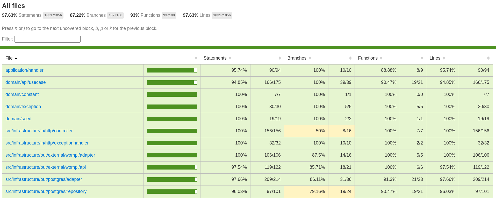
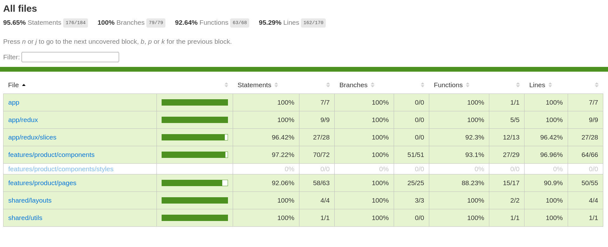

# Credit Payment

Sistema de pagos con tarjeta de crédito desarrollado con arquitectura hexagonal. Permite realizar transacciones de compra de productos con procesamiento de pagos en tiempo real.

## Descripción del Sistema

Este proyecto implementa un sistema completo de procesamiento de pagos que maneja:

### Entidades Principales

#### 🧑‍💼 Customer (Cliente)
Gestión de información de clientes registrados en el sistema:
- **ID**: Identificador único UUID
- **Datos personales**: Nombre, apellido, DNI
- **Contacto**: Teléfono y email
- **Relaciones**: Historial de transacciones de orden

#### 📦 Product (Producto) 
Catálogo de productos disponibles para la venta:
- **ID**: Identificador único UUID
- **Información**: Nombre, descripción detallada
- **Comercial**: Precio con precisión decimal, stock disponible
- **Media**: Imagen opcional del producto
- **Relaciones**: Transacciones asociadas

#### 🚚 Delivery (Entrega)
Información completa de envío y entrega:
- **ID**: Identificador único UUID
- **Dirección**: Dirección completa, país, ciudad, región
- **Detalles**: Código postal, nombre del destinatario
- **Costos**: Tarifa de envío opcional

#### 💳 Order Transaction (Transacción de Orden)
Entidad central que orquesta todo el proceso de compra:
- **ID**: Identificador único UUID
- **Gateway**: ID de transacción del gateway de pagos externo
- **Productos**: Cantidad y producto seleccionado
- **Financiero**: Total calculado con precisión decimal
- **Entrega**: Información de envío asociada
- **Cliente**: Cliente que realiza la transacción
- **Estado**: Status actual de la transacción
- **Legales**: Aceptación de políticas y autorización de datos
- **Auditoría**: Timestamp de creación

#### 📊 Transaction Status (Estado de Transacción)
Catálogo de estados posibles para las transacciones:
- **ID**: Identificador numérico
- **Nombre**: Descripción del estado (ej: Pendiente, Completado, Cancelado)
- **Relaciones**: Transacciones en este estado

### Modelo de datos

## Arquitectura

El sistema implementa **Arquitectura Hexagonal (Ports & Adapters)** con:
- **Backend**: NestJS + TypeORM + PostgreSQL
- **Frontend**: React + Redux + TypeScript
- **Testing**: Jest para backend y frontend
- **Gateway de Pagos**: Integración con servicios externos

## Testing

### Backend Tests
<!-- Espacio para imagen de coverage del backend -->

### Frontend Tests  
<!-- Espacio para imagen de coverage del frontend -->

## Demo's
**Frontend App:** https://credit-payment-front.onrender.com/

**Backend API:** https://credit-payment.onrender.com/api

